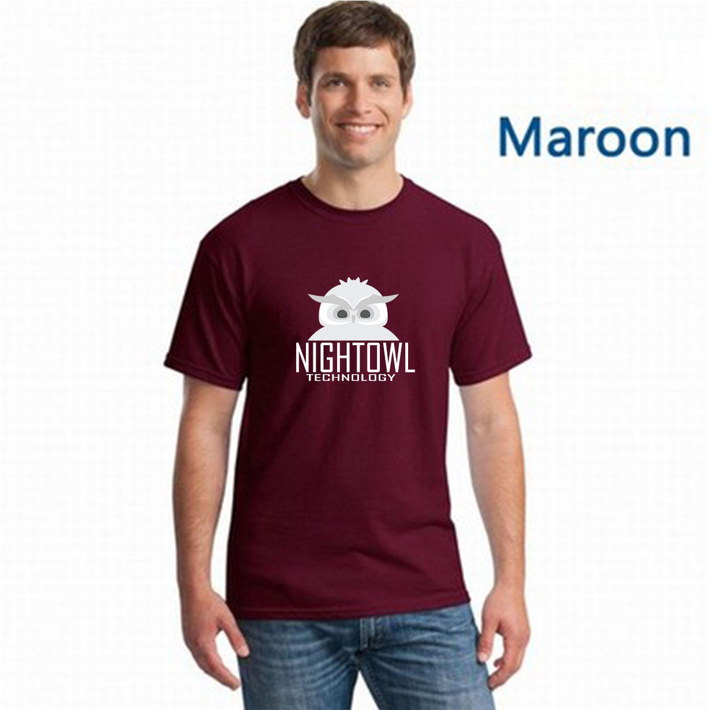
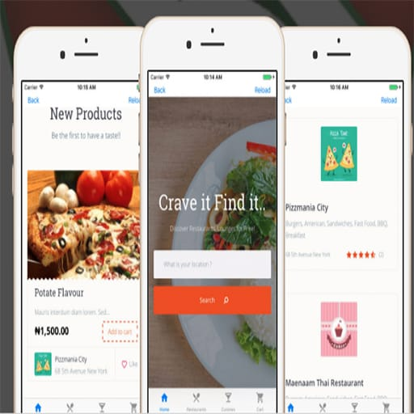

<!DOCTYPE html>
<html>
<!-- Full Name - Charles Demilade Toriola
ID - 181203002
Department - Computer Science
Level - 300 -->
<head>
	<link rel="shortcut icon" href="images/nt-black.png" type="image/x-icon">
	<title>Nightowl Technology - Let's Tech it. | Mobile Apps - CCTV = Softwares</title>
	<link rel="stylesheet" type="text/css" href="css/styles.css">
	<link rel="stylesheet" href="https://cdnjs.cloudflare.com/ajax/libs/font-awesome/4.7.0/css/font-awesome.min.css">
</head>
<body>
	<nav class="nav">
		

			<a href="index.html" class="navlink">
Home
</a>
			<a href="pages/projects.html" class="navlink">
Projects
</a>
			
			
			<a href="pages/shop.html"class="navlink">
Shop
</a>
			<a href="pages/contact.html"class="navlink">
Contact Us
</a>
			<a href="pages/cart.html"><button class="navbtn"><i class="fa fa-shopping-cart"></i></button></a>
		

		

	</nav>

	<nav class="mobilenav">
		

			
			<a href="pages/cart.html" ><button class="btn" ><i class="fa fa-shopping-cart"></i></button></a>
			<button class="btn click"><i class="fa fa-bars"></i></button>
			
			
			

				
<a href="index.html" class="mobilenavlink">
Home
</a>

				
<a href="pages/projects.html" class="mobilenavlink">
Projects
</a>

				
<a href="pages/shop.html"class="mobilenavlink">
Shop
</a>

				
<a href="pages/contact.html"class="mobilenavlink">
Contact Us
</a>

			

		

		
	</nav>
	
	<!--- Nav Bar --->

	

		

			<h1 class="slidertext fixed">Lets TECH it!</h1>		
			
IF LIFE IS BECOMING SMARTER, WHY WON'T YOU ?

			

				<a class="button reduce" style="display: flex; flex-direction: row;" href="pages/projects.html"><i class="fa fa-play link" id="reduce"></i>VIEW OUR WORK</a>
			

		

	

	

		
		

			<h1 class="infotext">WHAT WE DO</h1>
			
NIGHTOWL TECHNOLOGY PROVIDES IT/SOLUTION RELATED TO SOFTWARE AND HARDWARE ACROSS NIGERIA
	
		

		

		

			 

			  

			    

			      <h1 class="fliptext">Security Gadgets</h1>
			      
We Supply & Install Security Gadgets

			    

			    

			      
We supply & install CCTV surveillance camera to ensure good monitoring of your home and business place

			    

			  

			

			 

			  

			    

			      <h1 class="fliptext">Website Design</h1>
			      
Build online presence with us

			    

			    
			    

			      
We develop 100% fully responsive website that is very easy to use and manage

			    

			  

			
 

			 

			  

			    

			    	<h1 class="fliptext" id="mobile">Mobile Apps</h1>
			      
We Build Apps for both IOS and Android

			     
			    

			    
			    

			     
We design and develop mobile applications with excellent design and powerful user experience that is very easy to use

			    

			  

			
 
		

		

			 

			  

			    

			       <h1 class="fliptext">Student Portal</h1>
			      
Make it easy for all

			    

			    

			      
We design and develop school management system to ease grade computation. help parents to monitor their children performance and much more.

			    

			  

			

			 

			  

			    

			       <h1 class="fliptext">Tech Patnering
			       </h1>
			      
Lets work together

			    

			    
			    

			      
Do you have an innovative idea?  let’s work together and make your dreams come true. Nightowl Technology is equipped with experienced youth and professional team.

			    

			  

			
 

			 

			  

			    

			       <h1 class="fliptext">Custom Branding</h1>
			      
Buy our cusom brand accessories

			    

			    
			    

			      
Feel free to visit our shop & buy custom branded Nightowl shirts, Caps, Stickers and MacBook cases. <a href="pages/shop.html">Go to store</a>

			    

			  

			
 
		

		

			

				
				<h1 class="apptext">Our Apps</h1>
				
CLICK BELOW TO VIEW OUR APPS CATALOGUE

				

					<a class="button " style="margin-bottom: 2vh; display: flex; flex-direction: row;" href="" ><i class="fa fa-play link" id="reduce2"></i>Our Playstore Apps</a>
					<a class="button " style="display: flex; flex-direction: row;" href=""><i class="fa fa-play link" id="reduce2"></i>Our Appstore Apps</a>
				

			

			<a href="#sale"><i class="fa fa-chevron-down" id="appslink" style="color: white;"></i></a>
		

		

			
			<h1 class="saletext">FEATURED PRODUCTS</h1>
			

				

					
					

						

							
Uncategorized

							
$4000.00 $3000.00

						

						

							

				                <i class="fa fa-shopping-cart" style="margin-top: 1.4vw; margin-right: 1vw; color: white;"></i>
				                
Add to cart

				            

							

				                <i class="fa fa-list-ul" style="margin-top: 1.4vw; margin-right: 1vw; color: white;"></i>
				                
Details

				            

						

					

				

				

					
					

						

							
Uncategorized

							
$4000.00 $3000.00

						

						

							

				                <i class="fa fa-shopping-cart" style="margin-top: 1.4vw; margin-right: 1vw; color: white;"></i>
				                
Add to cart

				            

							

				                <i class="fa fa-list-ul" style="margin-top: 1.4vw; margin-right: 1vw; color: white;"></i>
				                
Details

				            

						

				

			

				

					
					

						

							
Uncategorized

							
$4000.00 $3000.00

						

						

							

				                <i class="fa fa-shopping-cart" style="margin-top: 1.4vw; margin-right: 1vw; color: white;"></i>
				                
Add to cart

				            

							

				                <i class="fa fa-list-ul" style="margin-top: 1.4vw; margin-right: 1vw; color: white;"></i>
				                
Details

				            

						

				

			

		

		<a class="button reduce" style="display: flex; flex-direction: row;color: white;background-color: #2176ff; margin-top: 10vh;" href="pages/shop.html"><i class="fa fa-play link" id="reduce"></i>VISIT OUR SHOP</a>
		<a href="#ready"><i class="fa fa-chevron-down" id="appslink" style="color: black;"></i></a>
	

		

			

				
				<h1 class="readytext">Are You Ready</h1>
				
CONTACT US AND LET’S TALK BUSINESS

				

					<a class="button reduce" style="display: flex; flex-direction: row;" href="pages/contact.html"><i class="fa fa-play link" id="reduce3"></i>Contact Us</a>
				

			
			
		

		

			

				
 © Copyright - 2020    |  Contact 08034135061  |   Powered by Nightowl Technology

				

					
					
				

			

		

	

	
</body>
</html>
